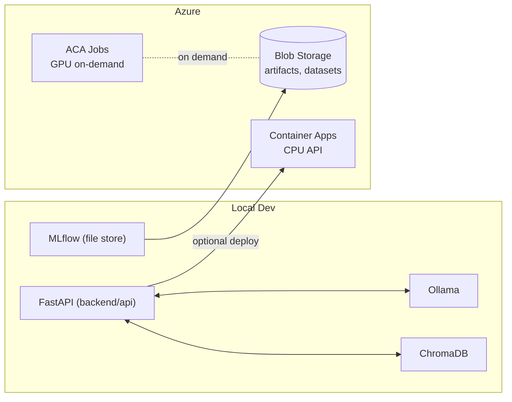

# LLMOps – Azure + Standalone (Local‑First)

A **minimal, low‑cost LLMOps starter** you can run on your laptop and optionally deploy to **Azure Container Apps**. It favors:

- Local dev with **Ollama** (CPU-friendly)
- **ChromaDB** for local vector search (RAG)
- **FastAPI** service you can run locally or deploy to Azure (CPU)
- **MLflow** for experiment tracking (local or Azure-backed)
- **Azure Blob Storage** for artifacts (cheap), optional **ACA Jobs (GPU)** for on‑demand fine‑tunes

> Goal: learn and ship LLM apps without racking up cloud bills.

---

## ✨ Features

- **Local‑first** development (no cloud required)
- **Ollama** local model serving (simple, CPU-friendly)
- **RAG‑ready** app scaffold (slots to add Chroma/embeddings)
- **Experiment tracking** with MLflow (file store by default)
- **Cheap Azure deployment** (CPU) + optional **ephemeral GPU job** pattern

---

## 🗂️ Repo Layout

```
./
├─ backend/
│  ├─ api/
│  │  ├─ main.py            # FastAPI service (with MLflow logging)
│  │  └─ requirements.txt
│  └─ tests/
├─ mlops/
│  ├─ track_example.py      # MLflow example run
│  ├─ analyze_metrics.py    # Metrics analysis & comparison tool
│  └─ requirements.txt
├─ scripts/
│  ├─ run_local.sh          # Start FastAPI locally
│  ├─ create_test_chats.sh  # Generate test requests for benchmarking
│  └─ set_env_example.sh    # Example env vars
├─ azure/
│  ├─ aca/
│  │  ├─ deploy.md          # Step-by-step Azure deployment (cheap)
│  │  └─ deploy.sh          # Helper script (az CLI)
│  └─ storage/
│     └─ create_blob.md     # Create Storage Account + container
├─ docker/
│  └─ Dockerfile            # Container for backend/api
├─ Makefile                 # Task automation (start-all, analyze, etc.)
├─ .env.local.example       # Local app config template
├─ .env.bootstrap.example   # Azure bootstrap config template
├─ .gitignore
├─ LICENSE
└─ README.md
```

---

## 🧰 Prereqs

- **Python 3.11+**, **pip**
- **Docker** (optional, for container runs)
- **Azure CLI** (`az`) if deploying to Azure
- Optional local serving:
  - **Ollama** (quickest start, CPU-friendly)

> Tip: keep local MLflow (file store) and only use Azure Blob for artifacts when you need remote sharing.

---

## 🚀 Quick Start (Local)

### Fastest way (one command):
```bash
make start-all
```

This will:
1. Start the FastAPI service
2. Launch MLflow UI
3. Generate 5 test chats with varying temperature settings
4. Display metrics analysis (latency, throughput, tokens)
5. Show you the dashboard & API links

### Step-by-step setup (if you prefer):

1) **Create a virtual env** and install dependencies:
```bash
python -m venv .venv && source .venv/bin/activate
pip install -r backend/api/requirements.txt
```

2) **(Optional) Start Ollama** on your machine and pull a model:
```bash
# Install Ollama per official docs, then:
ollama pull llama3
```

3) **Create local env file**:
```bash
cp .env.local.example .env.local
```

4) **Run the API**:
```bash
make run-local
```

5) **Test the service**:
```bash
curl -s -X POST http://127.0.0.1:8000/chat \
  -H 'Content-Type: application/json' \
  -d '{"prompt":"Explain retrieval-augmented generation"}' | jq
```

The API expects `OLLAMA_BASE_URL` to be set (defaults to `http://localhost:11434`).

---

## 🏃 Make Targets (Auto-tasks)

| Target | Purpose |
|--------|---------|
| `make start-all` | **Run everything**: API + MLflow + test chats + analysis |
| `make run-local` | Start just the FastAPI service |
| `make test-chats` | Generate 5 test requests (different temperatures) |
| `make analyze` | Show metrics analysis (latency, throughput, tokens/sec) |
| `make mlflow-ui` | Browse MLflow experiments at http://127.0.0.1:5000 |

---

## 🧪 Metrics & Experiment Tracking (MLflow)

### API Metrics Logging

The FastAPI service automatically logs detailed metrics to MLflow when `MLFLOW_ENABLED=1`:

**Logged Metrics (per request):**
- `latency_ms` — Response time in milliseconds
- `latency_sec` — Response time in seconds (for averaging)
- `input_tokens` — Approximate tokens in the prompt
- `output_tokens` — Approximate tokens in the response
- `total_tokens` — Combined input + output
- `tokens_per_second` — Generation throughput (efficiency metric)
- `success` — 1 for success, 0 for error

**Logged Parameters:**
- `temperature` — Randomness setting (0.0–1.0)
- `model` — Model name (e.g., `llama3`)
- `prompt_length` — Character count of input

### Analyze Metrics

After running test chats, view comprehensive metrics:
```bash
make analyze
```

This shows:
- **Run Summary** — Each request's latency, tokens, throughput
- **Temperature Impact** — How temperature affects response quality/speed
- **Aggregate Statistics** — Mean, median, min, max across all runs
- **CSV Export** — `mlruns/runs_export.csv` for custom analysis

### Browse Experiments

View all runs in an interactive dashboard:
```bash
make mlflow-ui
```
Then open **http://127.0.0.1:5000** to compare experiments.

### Custom Experiment Tracking

Use the example script to log your own runs:
```bash
python mlops/track_example.py
```

Artifacts and metadata go into `./mlruns/` by default. To use remote MLflow, set `MLFLOW_TRACKING_URI` and `MLFLOW_ARTIFACT_URI` (e.g., Azure Blob).

---

## ☁️ Azure (cheap) deployment

- **Blob Storage**: pennies per GB — store datasets, artifacts, and static assets.
- **Container Apps (CPU)**: scale‑to‑zero and low monthly costs for hobby use.
- **Container Apps Jobs (GPU)**: only spin up when needed for heavy tasks.

Follow: `azure/storage/create_blob.md` then `azure/aca/deploy.md`.

### Azure bootstrap (one-time)

Run the bootstrap script to register providers, create the tfstate storage, and set up OIDC:
```bash
az login
export SUBSCRIPTION_ID=00000000-0000-0000-0000-000000000000
export RESOURCE_GROUP=my-llmops-rg
export LOCATION=eastus
export TFSTATE_STORAGE_ACCOUNT=tfllmops
export TFSTATE_CONTAINER=tfstate
export APP_NAME=gha-llmops-azure
export GITHUB_REPO=devgoon/llmops-azure
export GITHUB_BRANCH=main

./scripts/bootstrap_azure.sh
```

You can also put these values in `.env.bootstrap` instead of exporting them. Start from `.env.bootstrap.example`.

### GitHub Actions deployment

This repo includes [`.github/workflows/deploy-azure.yml`](.github/workflows/deploy-azure.yml) to automatically deploy on every push to `main` (and via manual trigger).
For pull requests, [`.github/workflows/pr-ci.yml`](.github/workflows/pr-ci.yml) runs build-only checks (Python compile + Docker build) without deploying.

Configuration is file-based for portability:
- Defaults live in terraform/variables.tf
- Optional local overrides go in terraform/terraform.tfvars (see terraform/terraform.tfvars.example)
- Workflow settings (resource names + tfstate backend) live at the top of .github/workflows/deploy-azure.yml
- The workflow uses TF_VAR_* environment variables to pass settings into Terraform

Local infra apply (same defaults):
```bash
make deploy
```

Make sure your ACR name is globally unique in Azure (update both terraform/variables.tf and deploy-azure.yml if you change it).

Set these **Repository Secrets** for OIDC auth:
- `AZURE_CLIENT_ID`
- `AZURE_TENANT_ID`
- `AZURE_SUBSCRIPTION_ID`

OIDC setup (one-time in Azure):
- Create an App Registration (service principal)
- Add a Federated Credential for GitHub Actions (repo + branch)
- Grant the app `Contributor` on the target resource group

Terraform state:
- Ensure the storage account and container for tfstate already exist in Azure

The workflow will:
- run Terraform to provision Resource Group / ACR / Container Apps Environment
- build and push Docker image to ACR
- apply Terraform to create or update the Azure Container App

---

## 🧭 Architecture (Mermaid)



---

## 🧩 Next Steps

### Performance Tuning
- Use `make analyze` to identify bottlenecks (latency, throughput)
- Compare temperatures via the **Temperature Impact** analysis
- Export metrics to CSV (`mlruns/runs_export.csv`) for custom analysis
- Monitor `tokens_per_second` to optimize for inference speed vs cost

### Feature Development
- Add embeddings + ChromaDB calls to `backend/api/main.py` for RAG demo
- Integrate vector search into `/chat` endpoint
- Add cost estimation metrics (tokens × price per model)
- Compare different Ollama models (mistral, neural-chat, etc.)

### Scaling & Deployment
- Point MLflow to Azure Blob for persistent artifact storage
- Deploy API to Azure Container Apps (CPU for inference)
- Set up ACA Jobs (GPU) for model fine-tuning via batch requests
- Add GitHub Actions CI/CD (already configured in `.github/workflows/`)

---
## ⚙️ Environment Configuration

Two separate configs keep concerns isolated:

### `.env.local` — Local App Runtime
For running the API locally. Includes:
- `OLLAMA_BASE_URL` — Ollama server address
- `OLLAMA_MODEL` — Model to use (default: `llama3`)
- `APP_HOST` / `APP_PORT` — API binding
- `MLFLOW_ENABLED` — Enable/disable metric logging (0 or 1)

Start from `.env.local.example`:
```bash
cp .env.local.example .env.local
```

### `.env.bootstrap` — Azure Infrastructure Setup
For one-time Azure bootstrap and Terraform state. Used by:
- `scripts/bootstrap_azure.sh` — Register providers, create tfstate storage
- `Makefile deploy` — Terraform apply

Start from `.env.bootstrap.example`:
```bash
cp .env.bootstrap.example .env.bootstrap
```

Both are Git-ignored for security.

---

PRs welcome. MIT licensed.