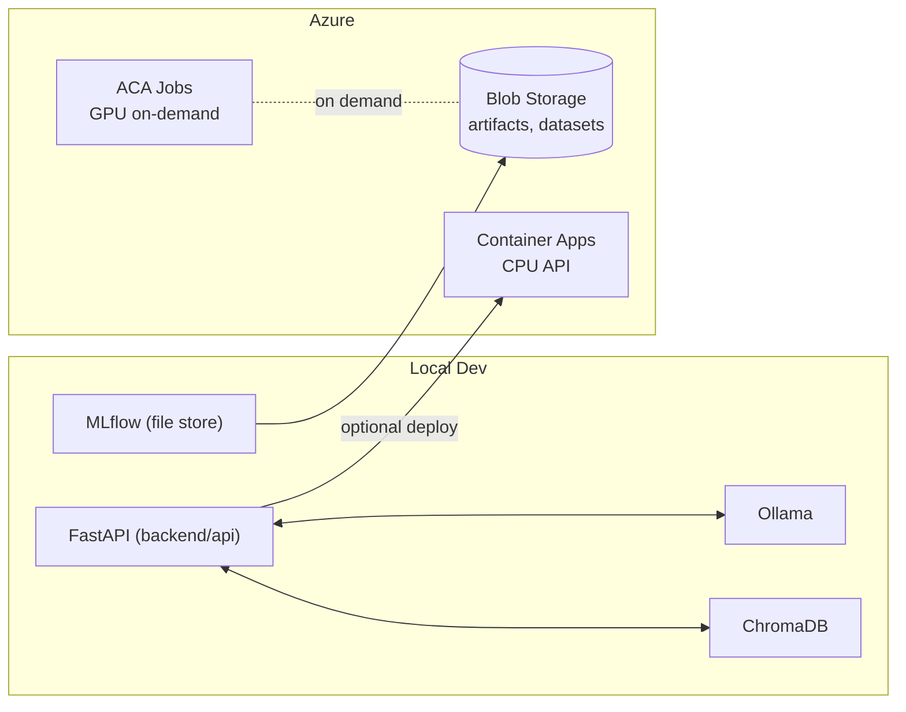

# LLMOps – Azure + Standalone (Local‑First)

A **minimal, low‑cost LLMOps starter** you can run on your laptop and optionally deploy to **Azure Container Apps**. It favors:

- Local dev with **Ollama** (CPU-friendly)
- **ChromaDB** for local vector search (RAG)
- **FastAPI** service you can run locally or deploy to Azure (CPU)
- **MLflow** for experiment tracking (local or Azure-backed)
- **Azure Blob Storage** for artifacts (cheap), optional **ACA Jobs (GPU)** for on‑demand fine‑tunes

> Goal: learn and ship LLM apps without racking up cloud bills.

---

## ✨ Features

- **Local‑first** development (no cloud required)
- **Ollama** local model serving (simple, CPU-friendly)
- **RAG‑ready** app scaffold (slots to add Chroma/embeddings)
- **Experiment tracking** with MLflow (file store by default)
- **Cheap Azure deployment** (CPU) + optional **ephemeral GPU job** pattern

---

## 🗂️ Repo Layout

```
./
├─ backend/
│  ├─ api/
│  │  ├─ main.py            # FastAPI service
│  │  └─ requirements.txt
│  └─ tests/
├─ mlops/
│  ├─ track_example.py      # MLflow example run
│  └─ requirements.txt
├─ azure/
│  ├─ aca/
│  │  ├─ deploy.md          # Step-by-step Azure deployment (cheap)
│  │  └─ deploy.sh          # Helper script (az CLI)
│  └─ storage/
│     └─ create_blob.md     # Create Storage Account + container
├─ docker/
│  └─ Dockerfile            # Container for backend/api
├─ scripts/
│  ├─ run_local.sh          # Start FastAPI locally
│  └─ set_env_example.sh    # Example env vars
├─ .gitignore
├─ LICENSE
└─ README.md
```

---

## 🧰 Prereqs

- **Python 3.11+**, **pip**
- **Docker** (optional, for container runs)
- **Azure CLI** (`az`) if deploying to Azure
- Optional local serving:
  - **Ollama** (quickest start, CPU-friendly)

> Tip: keep local MLflow (file store) and only use Azure Blob for artifacts when you need remote sharing.

---

## 🚀 Quick Start (Local)

1) **Create a virtual env** and install the API:
```bash
python -m venv .venv && source .venv/bin/activate
pip install -r backend/api/requirements.txt
```

2) **(Optional) Start Ollama** on your machine and pull a model:
```bash
# Install Ollama per official docs, then:
ollama pull llama3
```

3) **Create local env file**:
```bash
cp .env.local.example .env.local
```

4) **Run the API**:
```bash
uvicorn backend.api.main:app --reload --port 8000
```

5) **Call the service**:
```bash
curl -s -X POST http://127.0.0.1:8000/chat -H 'Content-Type: application/json' \
  -d '{"prompt":"Explain retrieval-augmented generation in one paragraph."}' | jq
```

The API expects `OLLAMA_BASE_URL` to be set when running locally.

---

## 🧪 Experiment Tracking (MLflow)

Use the included example to log params/metrics locally:
```bash
python -m venv .venv && source .venv/bin/activate
pip install -r mlops/requirements.txt
python mlops/track_example.py
```
Artifacts and run metadata go into `./mlruns/` by default. To use a remote/managed MLflow, set `MLFLOW_TRACKING_URI` and `MLFLOW_ARTIFACT_URI` (e.g., to Azure Blob) before running the script.

To log API requests to MLflow, set `MLFLOW_ENABLED=1` and optionally `MLFLOW_EXPERIMENT` in `.env.local`.

---

## ☁️ Azure (cheap) deployment

- **Blob Storage**: pennies per GB — store datasets, artifacts, and static assets.
- **Container Apps (CPU)**: scale‑to‑zero and low monthly costs for hobby use.
- **Container Apps Jobs (GPU)**: only spin up when needed for heavy tasks.

Follow: `azure/storage/create_blob.md` then `azure/aca/deploy.md`.

### Azure bootstrap (one-time)

Run the bootstrap script to register providers, create the tfstate storage, and set up OIDC:
```bash
az login
export SUBSCRIPTION_ID=00000000-0000-0000-0000-000000000000
export RESOURCE_GROUP=my-llmops-rg
export LOCATION=eastus
export TFSTATE_STORAGE_ACCOUNT=tfllmops
export TFSTATE_CONTAINER=tfstate
export APP_NAME=gha-llmops-azure
export GITHUB_REPO=devgoon/llmops-azure
export GITHUB_BRANCH=main

./scripts/bootstrap_azure.sh
```

You can also put these values in `.env.bootstrap` instead of exporting them. Start from `.env.bootstrap.example`.

### GitHub Actions deployment

This repo includes [`.github/workflows/deploy-azure.yml`](.github/workflows/deploy-azure.yml) to automatically deploy on every push to `main` (and via manual trigger).
For pull requests, [`.github/workflows/pr-ci.yml`](.github/workflows/pr-ci.yml) runs build-only checks (Python compile + Docker build) without deploying.

Configuration is file-based for portability:
- Defaults live in terraform/variables.tf
- Optional local overrides go in terraform/terraform.tfvars (see terraform/terraform.tfvars.example)
- Workflow settings (resource names + tfstate backend) live at the top of .github/workflows/deploy-azure.yml
- The workflow uses TF_VAR_* environment variables to pass settings into Terraform

Local infra apply (same defaults):
```bash
make deploy
```

Make sure your ACR name is globally unique in Azure (update both terraform/variables.tf and deploy-azure.yml if you change it).

Set these **Repository Secrets** for OIDC auth:
- `AZURE_CLIENT_ID`
- `AZURE_TENANT_ID`
- `AZURE_SUBSCRIPTION_ID`

OIDC setup (one-time in Azure):
- Create an App Registration (service principal)
- Add a Federated Credential for GitHub Actions (repo + branch)
- Grant the app `Contributor` on the target resource group

Terraform state:
- Ensure the storage account and container for tfstate already exist in Azure

The workflow will:
- run Terraform to provision Resource Group / ACR / Container Apps Environment
- build and push Docker image to ACR
- apply Terraform to create or update the Azure Container App

---

## 🧭 Architecture (Mermaid)



---

## 🧩 Next steps

- Add embeddings + ChromaDB calls into `backend/api/main.py` for a local RAG demo
- Point MLflow to Azure Blob for shared artifacts
- Add CI (GitHub Actions) to build & push the image, then `az containerapp up`

PRs welcome. MIT licensed.
